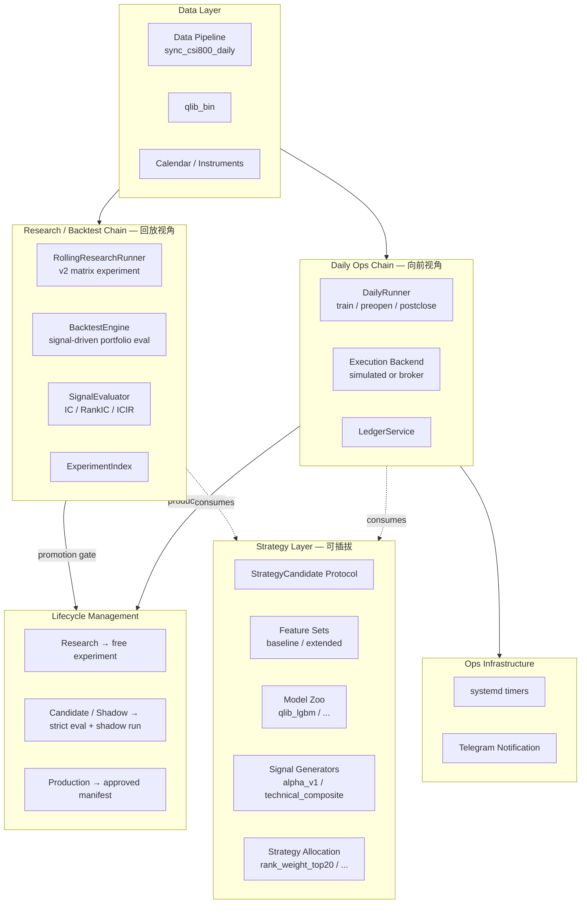
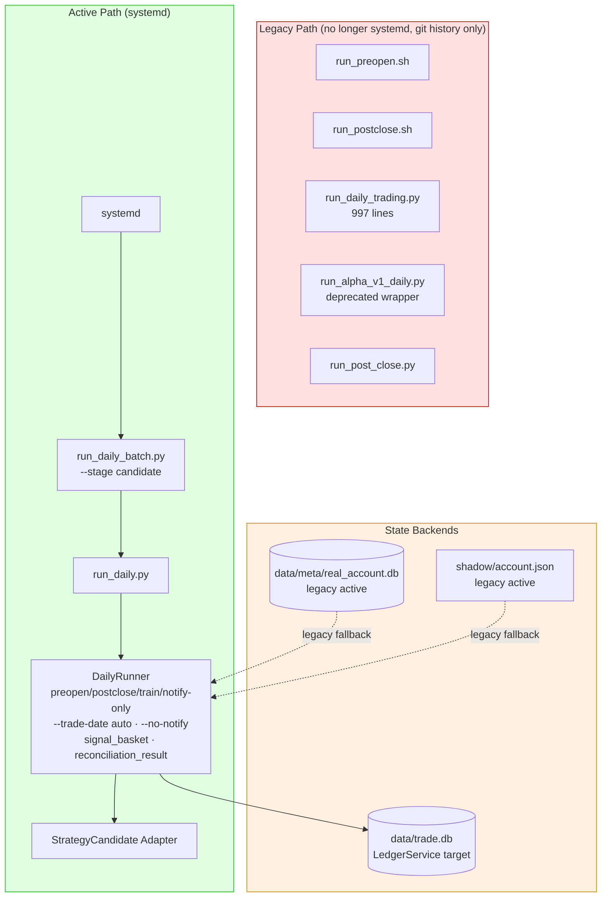
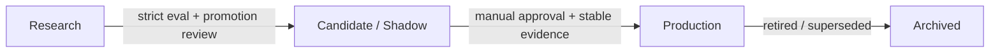

# ARCHITECTURE

本文档描述 Qsys 的**顶层系统设计、两条主链路、分层与当前过渡态**。
具体功能细节参考 `archive/docs/features/`（历史设计），设计决策记录在 `docs/adr/`。

> **阅读顺序**: 建议先读本文档，再读 `AGENTS.md`（治理协议），最后读 `ROADMAP.md`（当前优先级）。

---

## 1. 系统目标与设计原则

Qsys 是一个**个人可维护的 A 股日频量化系统**。它必须同时支持持续研究、严格评估、日常运营、渐进实盘、可审计回滚。

### 设计原则

- **研究自由，生产保守。** Research 可以快速试错，但不能绕过 Candidate/Shadow → Production 生命周期。
- **框架稳定，策略可插拔。** Runner、ledger、matcher、artifact contract 属于框架；feature、model、signal、allocation 属于策略层。
- **向后研究，向前运营。** Research/backtest 面向历史批量评估；Daily ops 面向未来逐日推进。二者复用执行语义但职责不同。
- **状态唯一，产物可追踪。** 账户、持仓、成交最终应收敛到 ledger SOT；daily/experiments/reports 是 evidence，不是多个事实源。
- **少入口，强契约。** 入口脚本只做编排，复杂逻辑下沉到 qsys；Candidate 以上阶段必须遵守 artifact contract。
- **Agent 不自动越权。** 涉及 ledger、production entry、broker bridge、protected core 的改动必须有人类确认。

### 两个核心区分

- **向后研究 vs 向前运营**：研究是历史回放视角，评估策略在历史上是否稳定、有增量；运营是推进视角，决定今天如何交易、如何记录结果。二者共享执行语义（撮合、成本、持仓演算），但编排器、数据流、产出截然不同。
- **Research → Candidate/Shadow → Production**：策略从自由实验到生产部署，必须经过严格评估和仿真运行。Research 结果不能直接接入 daily ops。

---

## 2. 系统总图

### 2.1 Target Architecture



图1：两条主链路共享数据层和策略层。Research 通过 promotion gate 决定哪些策略进入 Candidate/Shadow；Daily Ops 消费已批准的策略执行日常运营。OPS 层监控 daily 链路。

### 2.2 Current Transition State



图2：systemd 已切换至 `run_daily_batch.py`（绿色 Active Path）。旧 Legacy Path 仅留 git 历史。三态存储（橙色）表示 state migration 尚未完成。

---

## 3. 两条主链路

### 3.1 Research / Backtest Chain — 回放视角

**回答的问题**：某个 feature / model / signal / strategy 在历史上是否稳定、有增量、值得进入 Candidate？

**推荐调用关系**：

```
Data readiness
  → feature set
  → rolling train / predict
  → signal cache
  → BacktestEngine
  → SignalEvaluator
  → ExperimentIndex
  → Candidate decision
```

**边界规则**：

- `rolling train / predict` 只负责生成历史 out-of-sample signal，不负责组合构造。
- `BacktestEngine` 不训练模型，不管理 rolling window。它只消费已生成的 signal / prediction artifact。
- BacktestEngine 的职责：组合构造、调仓、撮合、成本、持仓演化和绩效计算。
- `SignalEvaluator` 的职责：IC / RankIC / ICIR / 分组收益等信号层评估。
- `ExperimentIndex` 的职责：横向比较多个实验，不直接影响 production。
- **Research 结果不能直接接入 daily ops**。必须进入 Candidate/Shadow 阶段，经过 strict eval + shadow run 才能接近生产。

### 3.2 Daily Ops Chain — 向前视角

**回答的问题**：在今天这个交易日，系统应该基于已批准策略生成什么计划，并如何记录执行结果？

**推荐调用关系**：

```
Data readiness
  → production manifest / strategy config
  → model freshness check
  → preopen: signal / plan / order intents
  → execution: shadow or broker
  → postclose: fills / MTM / reconciliation
  → ledger / daily evidence / notification
```

**三阶段职责**：

| 阶段 | 职责 | 不做什么 |
|------|------|---------|
| train / refresh | 周期性训练或刷新模型 | 不直接生成当天订单 |
| preopen | 检查数据 readiness，读取 approved manifest，生成 signal、plan、order intents | 不写成交状态 |
| postclose | 记录成交、估值、对账、报告 | 不修改已批准的 plan |

**Shadow vs Production**——不是两套框架：

| 维度 | Shadow | Production |
|------|--------|-----------|
| Runner | DailyRunner | DailyRunner |
| Execution Backend | simulated execution | broker bridge |
| Account | virtual / ledger | real + manual approval |
| Reconciliation | internal only | broker reconciliation |

Shadow 是运行模式，不是某一种数据库。Shadow mode 可以写入同一个 ledger，也可以在迁移期通过 legacy shadow files 兼容旧逻辑。

### 3.3 Shared Execution Kernel

Research/backtest 和 daily ops 应尽可能复用同一套执行语义：

- order generation：target weight → order intents
- matching / fills：限价/市价撮合逻辑
- transaction cost / slippage 模型
- T+1 / lot size / cash constraint
- portfolio accounting：持仓、现金、累计收益
- performance / reconciliation：收益率、换手、胜率

**当前状态**：目标是共享同一套语义，当前处于收束过程中。BacktestEngine 和 DailyRunner 正在逐步靠拢同一套 MatchEngine / OrderGenerator。在收束完成前，两端的口径差异由 runner 适配层处理，不扩散到策略层。

---

## 4. 分层架构

### 4.1 Data Layer

数据层是两条链路的共同前置条件：没有 readiness check，不能进入主流程。

| 组件 | 路径 | 职责 |
|------|------|------|
| Data Pipeline | `scripts/ops/sync_csi800_daily.py` + `qsys/` 内模块 | Tushare raw → qlib_bin + audit |
| Qlib Bin | `data/qlib_bin/` | QLib serving 数据 |
| Calendar / Instruments | `data/meta/meta.db` | 交易日历、股票基本信息 |

### 4.2 Framework Core（策略无关层）

职责：所有的编排骨架、状态管理、评估基础设施。

**硬规则**：
- Framework Core **不直接 import 策略实现**，不硬编码具体策略路径；只能通过 `StrategyCandidate` Protocol 或 config 解析策略。
- 框架的路径约定、日期语义、产物契约对所有策略统一。

| 组件 | 路径 | 职责 | 隶属链路 |
|------|------|------|---------|
| `DailyRunner` | `qsys/ops/daily_runner.py` | 盘前/盘后/训练编排 | Daily Ops |
| `BacktestEngine` | `qsys/backtest/engine.py` | 信号驱动的组合回测 | Research/Backtest |
| `RollingResearchRunner` | `qsys/research/rolling_runner.py` | 滚动研究（v1/v2 matrix）| Research/Backtest |
| `SignalEvaluator` | `qsys/research/signal.py` | IC/RankIC/ICIR 计算 | Research/Backtest |
| `SignalStore` | `qsys/signal/store.py` | SignalRun 持久化 | 共享 |
| `ExperimentIndex` | `qsys/research/experiment.py` | 实验索引收集 | Research/Backtest |
| `LedgerService` | `qsys/ledger/service.py` | 账户状态管理 | Daily Ops |
| `MatchEngine` | `qsys/trader/matcher.py` | 成交匹配 | 共享（收束目标）|
| `OrderGenerator` | `qsys/trader/diff.py` | 订单意图生成 | 共享（收束目标）|
| Checkers | `scripts/checks/` | signal/label/order intents/portfolio snapshot/reconciliation result/daily read model/experiment index 等静态验证 | 跨链路 |

### 4.3 Strategy Layer（策略相关层）

职责：可插拔的模型、特征、信号、策略构造。策略之间独立，不互相依赖。

这些模块是实现层结构，不要求用户日常逐层操作。研究入口应允许通过 signal expression 或 config abstraction 直接表达组合信号，例如 `raw(signal1) + 0.2 * zscore(signal2)`。日常研究入口应优先暴露简洁表达，让用户快速组合、评估和复用信号。

| 组件 | 路径 | 可插拔点 |
|------|------|---------|
| Feature Sets | `qsys/feature/groups/` | `baseline` / `extended` / 自定义 |
| Model Zoo | `qsys/model/` | `qlib_lgbm` / 未来扩展 |
| Signal Generators | `qsys/research/generators/` | `fixture` / `alpha_v1_existing` / `technical_composite` |
| Signal Transforms | `qsys/research/rolling_runner.py` `apply_signal_transform` | `identity` / `daily_zscore` |
| Signal Combinations | `qsys/research/signal_combine.py` | `linear_blend` / `equal_weight` / `confirm_filter` |
| Strategy Adapter | `qsys/strategy/<name>/adapter.py` | 实现 `StrategyCandidate` Protocol |
| Strategy Allocation | `qsys/strategy/allocation/` | `rank_weight_top20` / `rank_weight_top50_capped` |

### 4.4 State & Artifact Layer

**状态存储**："DB"不是架构语义本身。SQLite、DuckDB、JSON、CSV 只是介质。架构上真正重要的是：谁是账户状态 SOT，谁是 research analytics，谁是 evidence，谁只是 legacy compatibility。

| 对象 | 介质 | 路径 | 语义 | 当前角色 | 目标角色 | 备份/恢复 |
|------|------|------|------|---------|---------|---------|
| Account State / Execution Ledger | SQLite | `data/trade.db` | 账户、持仓、订单、成交、快照的结构化状态 | 新主线 | **唯一 SOT** | 每日/每次 postclose 前后备份 |
| Legacy Account Store | SQLite | `data/meta/real_account.db` | 旧 live/account 路径使用的账户状态 | active legacy | 迁移后只读/移除 | 迁移前保留备份 |
| Legacy Shadow Files | JSON/CSV | `shadow/` | 旧 alpha / shadow ops 兼容状态 | active compatibility | 只读或移除 | 迁移前保留原始文件 |
| Daily Evidence | files | `daily/{date}/` | 单日计划、执行、报告、manifest | 当前有效 | 当前有效 | 不覆盖，只追加/归档 |
| Research Artifacts | files | `experiments/` | 研究、训练、回测、评估结果 | 当前有效 | 当前有效 | 可重建但应保留关键报告 |
| Model Artifacts | files | `data/models/` | 训练模型与 approved manifest | 当前有效 | 当前有效 | approved model 必须可回滚 |
| Research Analytics Store | DuckDB / parquet / CSV | `scripts/research/query_experiment_duckdb.py` + `experiments/` | signal、label、IC/RankIC、实验索引查询 | 已有研究侧使用 | 研究分析加速层 | 可由原始 artifact 重建，但关键报告应保留 |

**目标不变量**：账户、持仓、成交最终必须收敛到 LedgerService；在迁移完成前，legacy path 只能作为 compatibility layer，不得扩展新依赖。

**产物契约（Artifact Contract）**：

ADR-007 定义了 6 种标准 artifact。Artifact Contract 在 Candidate/Shadow 及 Production 阶段变硬；Research 阶段可以更灵活，但进入 Candidate 前必须能转换成标准 artifact。契约的目标不是增加文档负担，而是让运行可追踪、可重建、可审计。

Artifact 的链式关系：

```
SignalArtifact → OrderIntentArtifact → ExecutionArtifact → PortfolioSnapshot → RunManifest
```

各 artifact 定位：

- **SignalArtifact**：记录某天某策略产生了什么信号。
- **OrderIntentArtifact**：记录由信号和账户状态推导出的目标订单意图。
- **ExecutionArtifact**：记录订单如何被模拟或真实执行。
- **PortfolioSnapshot**：记录执行后组合状态。
- **RunManifest**：串起一次运行的输入、输出、版本和证据。
- **CandidateReport**：汇总历史评估和 shadow 结果，服务晋级决策，不是 daily run 的必经产物。

| Artifact | 生产者 | 消费者 |
|----------|--------|--------|
| SignalArtifact | preopen pipeline | 计划生成、UI |
| OrderIntentArtifact | preopen pipeline | postclose execution |
| ExecutionArtifact | postclose pipeline | ledger、MTM |
| PortfolioSnapshot | postclose pipeline | MTM、报告 |
| CandidateReport | 候选评估 | 晋级决策 |
| RunManifest | 所有流程 | 审计、重建 |

详见 `docs/adr/007-artifact-contract.md` 和 `docs/schema/`。

### 4.5 Lifecycle Management

策略生命周期为三阶段：Research → Candidate/Shadow → Production。Shadow 是 Candidate 的运行模式，不是独立系统，也不是某种数据库。



图3：策略生命周期三阶段。稳定运行窗口由 ROADMAP / promotion checklist 定义，通常不低于数周。

| 阶段 | 允许操作 | 禁止操作 | 产物要求 |
|------|---------|---------|---------|
| **Research** | 自由实验 feature/model/signal/strategy，做历史回测和信号评估 | ❌ 直接进入 daily production，写真实账户状态 | research report / experiment index |
| **Candidate / Shadow** | 通过 stage-approved manifest 进入仿真 daily run，持续记录计划、执行、MTM、表现 | ❌ 自动实盘下单，影响 Production 状态，绕过 artifact contract | CandidateReport / SignalArtifact / OrderIntentArtifact / RunManifest / PortfolioSnapshot |
| **Production** | 经人工确认后接入 broker bridge，小资金实盘与真实对账 | ❌ Agent 自动下单，跳过审批和 reconciliation | execution artifact / ledger state / broker reconciliation / run manifest |
| **Archived** | 从 DAG 移除、标注 retired | — | 产物保留不删 |

### 4.6 Research Analytics & Monitoring

两个观测层都只读 artifact 和状态，不直接修改策略、ledger 或订单。

**Research Analytics** 关注批量查询和横向比较：signal、label、IC/RankIC、分组收益、backtest summary、experiment index 等研究分析结果的存储与查询。DuckDB 是已在研究侧使用的查询引擎，位于 research chain 侧，不参与 daily production 状态写入，不替代 `data/trade.db`，不参与 broker execution。它可以加速横向实验比较和 UI 查询。

**Monitoring** 关注系统健康和异常告警。

- **Research monitoring**：IC / RankIC / ICIR、分组收益、turnover、回撤、feature coverage、缺失率。
- **Daily ops monitoring**：数据 readiness、model freshness、plan diff、order intent 异常、postclose MTM、daily report。
- **Production / broker monitoring**：broker sync、execution fill、position gap、cash gap、reconciliation result、告警通知。

---

## 5. 模块 I/O 总表

### 5.1 Research / Backtest I/O

| 模块 | 输入 | 输出 | 状态写入 |
|------|------|------|---------|
| Feature Builder | qlib data, feature config | feature matrix | feature cache / experiments |
| Model Trainer | feature matrix, labels, split config | model artifact | experiments / data/models |
| Predictor | model artifact, feature matrix | signal cache | SignalStore / experiments |
| BacktestEngine | signal cache, price data, strategy config | portfolio curve, trades, metrics | experiments（不训练模型）|
| SignalEvaluator | signal cache, labels | IC, RankIC, ICIR | ExperimentIndex |
| ExperimentIndex | eval reports, backtest reports | comparison index | experiments |

### 5.2 Daily Ops I/O

| 模块 | 输入 | 输出 | 状态写入 |
|------|------|------|---------|
| DailyRunner (train) | approved config, data | model refresh result | data/models, reports（不直接下单）|
| DailyRunner (preopen) | production manifest, latest data, ledger | signal, plan, order intents, **signal_basket CSV** | daily/{date}/pre_open（不写成交）|
| Execution Backend | order intents, broker or simulator | fills, execution report | staging / daily |
| DailyRunner (postclose) | fills, prices, broker snapshot | MTM, reconciliation, **reconciliation_result.json** | ledger, daily/{date}/post_close |
| LedgerService | execution, snapshot, cash events | account state | data/trade.db |
| Notifier | run report | Telegram message（支持 **--no-notify** 跳过）| 不写状态 |

### 5.3 State / Artifact I/O

| 存储 | 写者 | 读者 | 角色 |
|------|------|------|------|
| data/trade.db | LedgerService | DailyRunner, ops tools | 目标 ledger SOT |
| data/meta/real_account.db | old live path | old daily entry | legacy（当前兼容，目标迁移）|
| shadow/ | alpha_v1, old ops | alpha adapters, plan builder | legacy（当前兼容，不是目标）|
| daily/{date} | daily ops | audit, UI, report | daily evidence |
| experiments | research chain | comparison, promotion | research artifact |
| data/models | train, promotion | daily ops | model artifact |

---

## 6. Current Transition State

### 6.1 目标态 vs 现实

| 维度 | 目标态 | 当前现实 | 差距 |
|------|--------|---------|------|
| 入口 | `run_daily.py` + `run_daily_batch.py` | systemd 已切换至 `run_daily_batch.py --stage candidate`。旧 legacy 入口不再被 systemd 调用。| ✅ systemd cutover 完成 |
| Ledger | `data/trade.db` 唯一 SOT | `trade.db` + `real_account.db` + `shadow/` 三态共存 | 需统一 + 迁移 |
| 研究→Candidate | RollingResearchRunner → ExperimentIndex → promotion checklist | RollingResearchRunner v2 已落地，promotion checklist 存在但未自动化 | 需自动化晋级门禁 |
| Candidate→Production | 候选 shadow run → eval → approval | 人工驱动，alpha_v1 已处 Shadow Baseline | 需自动化 gate |
| 执行语义共享 | BacktestEngine 与 DailyRunner 共享 MatchEngine / OrderGenerator | 尚未完全靠拢 | 收束中 |
| Ops SOP | 反映当前入口和流程 | SOP 已更新 target 入口信息（--trade-date auto、checkers） | 待同步 systemd cutover |

详细 agent 权限、Protected Core 修改流程和操作禁令见 `AGENTS.md`。本文档只描述架构边界和系统不变量。

---

## 7. 架构不变量（不可破坏的规则）

1. **`scripts/` 只做编排，不做复杂业务核心** — 业务逻辑下沉到 `qsys/`。
2. **数据 readiness 是训练、回测、daily ops 的前置条件** — 无 readiness check 不能进入主流程。
3. **默认 out-of-sample 评估** — 禁止 train/test 混用自评。
4. **目标不变量：Ledger 是账户/持仓/成交的事实标准** — 所有状态查询走 `LedgerService`，不直接读 CSV/JSON。在迁移完成前，legacy path 只能作为 compatibility layer，不得扩展新依赖。
5. **daily ops 只消费显式批准的 manifest** — 不认"最新模型目录"策略。
6. **Framework Core 与 Strategy Layer 严格分离** — Core 不直接 import 策略实现，不硬编码策略路径；只能通过 Protocol / config 解析策略。
7. **Research 不能直接进入 Production** — 必须经过 Candidate/Shadow 阶段。

---

## 8. 与其他文档的关系

- `AGENTS.md` — AI 操作说明书（角色、权限、禁止事项）
- `CONTRIBUTING.md` — 开发协作流程（branch → PR → merge）
- `ROADMAP.md` — 当前优先级与具体待办
- `archive/docs/features/` — 历史功能规格
- `docs/adr/` — 架构决策记录（索引见 `docs/DECISIONS.md`）
- `docs/schema/` — 产物契约 schema
- `docs/REPO_LAYOUT.md` — 代码、数据、artifact、report 放置规则
- `docs/ops/` — 运营 SOP
