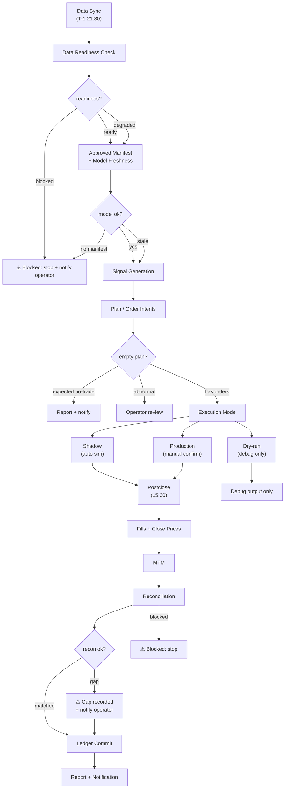
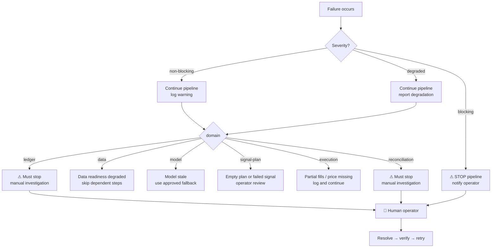

# DAILY_OPS_SOP

本文档是 daily ops 运行手册，不是架构文档。
系统设计、模块职责和过渡态见 `docs/ARCHITECTURE.md`，模块边界契约见 `docs/CONTRACTS.md`，产物路径规范见 `docs/REPO_LAYOUT.md`。

---

## 1. Purpose

当 daily ops 出问题时，根据本文档应该能回答：

- 今天应该从哪个入口跑；
- 当前实际 systemd 入口是什么；
- 目标唯一入口是什么；
- 每个阶段怎么检查；
- 失败先看哪里；
- 哪些命令可以安全执行；
- 哪些情况必须人工确认；
- 哪些步骤可以重跑，哪些不能随便重跑。

---

## 2. Current Entrypoints

### 2.1 Current systemd path

| 阶段 | Service | Timer | 实际调用链 |
|------|---------|-------|-----------|
| Data sync | `qsys-csi800-daily-sync.service` | Mon-Fri 21:30 | `scripts/ops/sync_csi800_daily.py --apply` |
| Preopen | `qsys-preopen.service` | Mon-Fri 08:00 | `scripts/run_preopen.sh` → `run_daily_trading.py` + `run_alpha_v1_daily.py --mode preopen` |
| Postclose | `qsys-post-close.service` | Mon-Fri 15:30 | `scripts/run_postclose.sh` → `run_post_close.py` + `run_alpha_v1_daily.py --mode postclose` |
| Weekly train | `qsys-alpha-v1-weekly-train.service` | Mon 07:00 | `scripts/run_alpha_v1_weekly_train.py` |
| Shadow daily | `qsys-shadow-daily.service` | daily 15:30 | `scripts/ops/run_shadow_daily.py` |

**关键事实**：当前 preopen 和 postclose systemd 入口仍是 `run_preopen.sh` / `run_postclose.sh`（shell wrapper）。这两个 wrapper 自身已声明 DEPRECATED，但在 systemd 切换之前它们仍是生产事实。

### 2.2 Target path

| 模式 | 目标命令 | 当前状态 |
|------|---------|---------|
| Preopen | `python scripts/run_daily.py --strategy <id> --mode preopen --trade-date <date>` | 可用，未接入 systemd |
| Postclose | `python scripts/run_daily.py --strategy <id> --mode postclose --trade-date <date>` | 可用，未接入 systemd |
| Batch preopen | `python scripts/run_daily_batch.py --stage candidate --mode preopen --trade-date <date>` | 可用，未接入 systemd |
| Batch postclose | `python scripts/run_daily_batch.py --stage candidate --mode postclose --trade-date <date>` | 可用，未接入 systemd |
| Train | `python scripts/run_daily.py --strategy <id> --mode train` | 可用，未接入 systemd |

在 systemd 尚未切换前，本文档不会把目标入口宣称为生产事实。

### 2.3 Manual debug path

| 场景 | 命令 |
|------|------|
| Dry-run preopen (no side effects) | `python scripts/run_daily.py --strategy alpha_v1 --mode preopen --trade-date YYYY-MM-DD --debug-run --no-notify` |
| Dry-run batch preopen | `python scripts/run_daily_batch.py --stage candidate --mode preopen --trade-date YYYY-MM-DD --dry-run --debug-run --no-notify` |
| Dry-run postclose | `python scripts/run_daily.py --strategy alpha_v1 --mode postclose --trade-date YYYY-MM-DD --debug-run --no-notify` |
| Notify only (from existing artifacts) | `python scripts/run_daily.py --strategy alpha_v1 --notify-only --trade-date YYYY-MM-DD` |

`--debug-run` 不修改 shadow/account.json / positions.csv / ledger.csv。`run_daily_batch.py` 另有 `--dry-run` 仅打印将要调度的策略而不执行。

---

## 3. Daily Timeline

```
       Mon 07:00   Mon-Fri 08:00       Mon-Fri 15:30    Mon-Fri 21:30
         │             │                    │                │
  weekly train     preopen              postclose        data sync
  (qsys-alpha-v1-  (qsys-preopen.       (qsys-post-       (qsys-csi800-
   weekly-train.    service)              close.service)    daily-sync.
   service)                                                    service)
```

### 盘前顺序

```
data sync (T-1 21:30)
  → weekly train (Mon 07:00)
  → preopen (08:00)
```

---

## 4. Daily Ops Flow



### 文本版（Mermaid 后备）

1. **Data Sync** (T-1 21:30) → **Readiness Check**
2. **Ready/Degraded** → continue；**Blocked** → stop + notify operator
3. **Approved Manifest + Model Freshness** → Signal Generation
4. **Plan / Order Intents** → 检查是否空 plan
   - Expected no-trade → notify only
   - Abnormal empty → operator review
   - Has orders → 进入 execution mode（shadow / production manual / dry-run）
5. **Postclose** (15:30) → fills + close prices → MTM → reconciliation
   - Reconciliation matched → ledger commit
   - Gap → 记录 gap + notify，仍可 commit
   - Blocked reconciliation → stop
6. **Report + Notification**

---

## 5. Preopen Runbook

### Inputs

- T-1 数据（data sync 结果）
- approved model manifest
- model artifact（来自 weekly train 或 manual refresh）
- 上一交易日账户状态（从 ledger 读取）
- strategy config

### Checks

按顺序执行：

| 检查 | 方法 | 阻断条件 |
|------|------|---------|
| Latest raw date | 检查 readiness | raw < T-1 则 blocked |
| Latest qlib date | 检查 readiness | qlib < T-1 则 blocked |
| Model freshness | 检查 approved manifest 中的 model_version | 无 manifest 阻断；model 过时降级 |
| Account state | `sqlite3 data/trade.db` 查询上一 snapshot | ledger 不可用尝试 legacy fallback |
| Signal generation | `run_daily.py` 自动完成 | 失败阻断 |
| Plan / order intents | `run_daily.py` 自动完成 | 空 plan 区分 expected vs abnormal |

### Expected outputs

```
daily/{date}/pre_open/signals/
daily/{date}/pre_open/plans/
daily/{date}/pre_open/order_intents/
daily/{date}/pre_open/manifests/
```

### Failure handling

| Symptom | Severity | First check | Safe action | Must not do |
|---------|----------|-------------|-------------|-------------|
| Data blocked | blocking | `journalctl -u qsys-csi800-daily-sync.service` 检查 sync 日志 | 重跑 sync；仍失败则跳过 preopen | 生成假推荐 |
| No approved manifest | blocking | `ls daily/{date}/pre_open/manifests/` 或 model registry | 确认是否从 weekly train 生成 | 用"最新模型目录"替代 |
| Stale model | degraded | 检查 model_version 的 train_end 日期 | 降级运行旧模型，写入报告 | 用 in-sample signal 当可交易 signal |
| Missing previous account state | blocking | `sqlite3 data/trade.db "SELECT * FROM snapshots ORDER BY snapshot_time DESC LIMIT 1;"` | 尝试 legacy fallback (`data/meta/real_account.db`) | 直接写 ledger |
| Signal generation failed | blocking | `journalctl -u qsys-preopen.service` | 检查 data readiness、model artifact | 跳过 signal 直接生成 plan |
| Empty plan | warning | 检查 plan JSON 中的 reason 字段 | expected no-trade → 正常通知；abnormal → 人工确认 | 视为失败阻断当天 |
| Order intent generation failed | blocking | 检查 signal 和 allocation 中间产物 | 修复后重跑 | 生成假 order intent |

**关于空 plan**：空 plan 不一定是失败。必须区分：
- **Expected no-trade**：条件不满足（如 signal 无有效信号、risk constraint 阻止），plan 中应包含 reason 字段。正常通知，记录 evidence。
- **Abnormal empty**：pipeline 提前退出，plan 文件不完整或缺失。需人工排查。

---

## 6. Postclose Runbook

### Inputs

- 当日 order intents（来自 preopen）
- Fills / execution report（来自 broker bridge 或 shadow simulation）
- 当日收盘价（来自 qlib）
- 上一交易日组合状态（来自 ledger）
- Broker snapshot（如有）

### Checks

按顺序执行：

| 检查 | 方法 | 阻断条件 |
|------|------|---------|
| Fills complete | 检查 fills 记录与 order intents 对比 | missing fill → 记录，继续 |
| Close price available | 检查 qlib 数据 | 缺失 → 跳过对应标的 MTM |
| MTM result | `run_daily.py` 自动计算 | 计算失败阻断 |
| Reconciliation result | `run_post_close.py` 自动计算 | blocked reconciliation 阻断 |
| Ledger commit | `run_daily.py` 自动提交 | 写入失败阻断 |
| Report generated | 检查 `daily/{date}/post_close/` 产物 | 可重跑 |

### Commit Boundary

- **postclose 是允许提交 execution / portfolio snapshot 的阶段**。
- Ledger 写入必须经过 `run_daily.py` → `DailyRunner` / `LedgerService` 的 controlled commit path。
- 策略 adapter 不允许直接写 ledger。
- preopen 阶段只能读 ledger，不能写。

### Failure handling

| Symptom | Severity | First check | Safe action | Must not do |
|---------|----------|-------------|-------------|-------------|
| Missing fills | warning | `daily/{date}/post_close/` 下检查 fills 文件 | 重新拉取 broker snapshot | 手动补填 fill 记录 |
| Missing close price | degraded | `daily/{date}/post_close/` 下检查 MTM | 跳过对应标的 | 用前日收盘价替代 |
| Ledger write failed | blocking | `journalctl -u qsys-post-close.service` | 检查 DB 锁或磁盘空间 | 直接写 `data/trade.db` |
| Reconciliation gap | warning | 检查 `reconciliation_result` 输出 | 记录 gap，通知 operator | 自动修正 ledger |
| Broker snapshot unavailable | degraded | `ls -la /home/liuming/.openclaw/broker/` 检查同步文件 | 跳过 broker reconciliation，只做 shadow | 中断当天流程 |
| Report generation failed | non-blocking | 检查 report 产出路径 | 重新生成 | 阻塞 postclose |
| Notification failed | non-blocking | `journalctl` | 单独重发通知 | 影响主流程 |

---

## 7. Failure Handling Flow



### 文本版（Mermaid 后备）

**Non-blocking**：记录警告，流程继续（如 report gen failed、notification failed）。

**Degraded**：流程继续但必须记录降级原因（如 stale model、missing close price、broker snapshot unavailable）。

**Blocking**：流程停止，通知 operator。覆盖六类 domain：
- **Data**：data blocked → 重跑 sync 或跳过当天
- **Model**：no approved manifest → 确认训练是否完成
- **Signal/Plan**：empty plan 或 failed signal → 人工确认原因
- **Execution**：missing fills → 可尝试重新拉取，不影响 ledger
- **Ledger**：ledger write failed → **必须人工确认**，不自动重试
- **Reconciliation**：blocked reconciliation → **必须人工比对**，不自动修正

---

## 8. Command Cheat Sheet

### 查看 systemd 状态

```bash
# 所有 SysQ 服务状态
systemctl --user list-units 'qsys-*'

# 单个服务状态
systemctl --user status qsys-preopen.service
systemctl --user status qsys-post-close.service
systemctl --user status qsys-csi800-daily-sync.service

# 查看最近一次运行日志
journalctl --user -u qsys-preopen.service -n 50 --no-pager
journalctl --user -u qsys-post-close.service -n 50 --no-pager
journalctl --user -u qsys-csi800-daily-sync.service -n 50 --no-pager

# 持续跟踪日志
journalctl --user -u qsys-preopen.service -f
```

### 查看当天产物

```bash
# 列出当天 preopen 产物
ls daily/YYYY-MM-DD/pre_open/signals/
ls daily/YYYY-MM-DD/pre_open/plans/
ls daily/YYYY-MM-DD/pre_open/order_intents/

# 列出当天 postclose 产物
ls daily/YYYY-MM-DD/post_close/

# 查看 daily ops digest（如有）
cat daily/YYYY-MM-DD/post_close/daily_ops_digest_*.json | python -m json.tool
```

### 检查数据 readiness

```bash
# 手动触发数据同步
python scripts/ops/sync_csi800_daily.py --apply

# 检查数据健康（待实现 → 统一 readiness 命令）
# 当前建议：直接检查文件存在性和日期
ls -la data/qlib/csi800/daily/  # 检查 qlib 数据日期
```

### 跑 preopen

```bash
# 当前 legacy（systemd 实际路径）
python scripts/run_daily_trading.py --date T-1 --execution_date YYYY-MM-DD

# 目标入口（dry-run 模式，不写 shadow）
python scripts/run_daily.py --strategy alpha_v1 --mode preopen --trade-date YYYY-MM-DD --debug-run --no-notify

# 目标入口（正式运行）
python scripts/run_daily.py --strategy alpha_v1 --mode preopen --trade-date YYYY-MM-DD

# Batch 模式
python scripts/run_daily_batch.py --stage candidate --mode preopen --trade-date YYYY-MM-DD --dry-run
```

### 跑 postclose

```bash
# 当前 legacy（systemd 实际路径）
python scripts/run_post_close.py --date YYYY-MM-DD --real_sync /path/to/sync/file

# 目标入口（dry-run）
python scripts/run_daily.py --strategy alpha_v1 --mode postclose --trade-date YYYY-MM-DD --debug-run --no-notify

# 目标入口（正式运行）
python scripts/run_daily.py --strategy alpha_v1 --mode postclose --trade-date YYYY-MM-DD
```

### 检查 ledger

```bash
# 查看 trade.db 表结构
sqlite3 data/trade.db ".tables"

# 按实际 schema 查询（表名以实际为准）
sqlite3 data/trade.db "SELECT * FROM snapshots ORDER BY snapshot_time DESC LIMIT 5;"
sqlite3 data/trade.db "SELECT * FROM fills ORDER BY execution_date DESC LIMIT 10;"
sqlite3 data/trade.db "SELECT * FROM positions ORDER BY execution_date DESC LIMIT 10;"
```

### 通知

```bash
# Telegram 测试
bash scripts/notify_telegram.sh "测试消息"

# 仅重新发送通知（不执行交易）
python scripts/run_daily.py --strategy alpha_v1 --notify-only --trade-date YYYY-MM-DD
```

---

## 9. Safe Retry Rules

### Safe to retry

- Read-only check（检查 readiness、check ledger、check 产物）
- Report regeneration
- Notification resend
- Data readiness check
- Dry-run / debug-run

### Retry with caution

- Preopen plan regeneration（确认上一轮没有已下发订单）
- Shadow execution replay
- Postclose MTM recompute

### Do not retry without human confirmation

- **Ledger commit**：确认上一轮写入状态，避免 double commit
- **Broker order submission**：确认上一轮订单状态，避免重复下单
- **Reconciliation correction**：人工比对后再操作
- **Legacy state migration**：需确认 migration script 安全
- **Cash / position correction**：人工确认差异原因

---

## 10. Manual Recovery

| 场景 | 处理步骤 |
|------|---------|
| **Data blocked** | `journalctl -u qsys-csi800-daily-sync.service` 检查 sync 失败原因 → 修复（网络、quota、数据源）→ 手动重跑 `sync_csi800_daily.py --apply` → 仍失败则跳过当天 preopen |
| **No approved manifest** | 检查 weekly train 是否成功 → 如未训练，手动触发：`python scripts/run_alpha_v1_weekly_train.py` 或 `python scripts/run_daily.py --strategy alpha_v1 --mode train` → 确认 manifest 生成 |
| **Stale model** | 若有 approved fallback model，使用 `--model_path` 指定 → 通知 operator 确认是否跳过一次训练 |
| **Empty plan** | 检查 plan 日志中的 reason → expected no-trade → 无需操作；abnormal → 检查 signal / readiness / manifest |
| **Reconciliation gap** | 只记录，不自动修正 → 人工比对 broker snapshot 和 ledger → 走 reconciliation 修正流程 |
| **Ledger mismatch** | 先备份 `data/trade.db` → 人工分析差异原因 → 走修正流程，不直接覆盖 |
| **Notification failure** | `bash scripts/notify_telegram.sh "消息内容"`，不影响 ledger |
| **Legacy state inconsistency** | 以 `data/trade.db` 为准，记录差异，不自动迁移 |

---

## 11. UI / Monitoring

Ops UI 应只读展示：

- Data readiness（ready / degraded / blocked）
- Latest data date
- Daily plan
- Order intents
- Shadow / production status
- Ledger snapshot
- Postclose report
- Reconciliation gap
- Blocking reason

**UI 不写 ledger，不下单，不改策略。**

Monitoring 告警触发点：

| 告警 | 触发条件 | 严重度 |
|------|---------|--------|
| Data blocked | readiness = blocked | blocking |
| Stale data | latest_raw_date < T-2 | degraded |
| Stale model | model 过时超过阈值 | degraded |
| Empty plan | preopen 无 plan 生成 | warning |
| Reconciliation gap | position_gap ≠ 0 或 cash_gap ≠ 0 | warning |
| Reconciliation blocked | status = blocked | blocking |
| Account stale | 超过 2 个交易日无 snapshot | degraded |
| Notification failure | notify call 返回非 0 | non-blocking |

---

## 12. Do Not

- **不无人值守下单**。自动 broker execution 必须经过人工确认。
- **不直接编辑 ledger**。所有写入必须通过 `run_daily.py` / `LedgerService`。
- **不删除 legacy state**。`data/meta/real_account.db` 和 `shadow/` 删除前必须完成 consumer 切换、数据迁移和回归验证。
- **不绕过 artifact contract**。所有 preopen / postclose 产物应符合 `docs/CONTRACTS.md`。
- **不把旧入口扩张成新长期接口**。`run_preopen.sh`、`run_postclose.sh`、`run_alpha_v1_daily.py` 是 DEPRECATED，不扩展新依赖。
- **不在 reconciliation gap 未处理时推进 production execution**。
- **不在 blocked 时生成假推荐或假 plan**。
