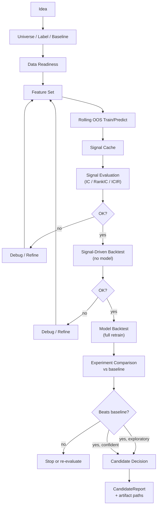

# RESEARCH_STRATEGY_SOP

本文档是从策略想法到 Candidate 候选的研发操作手册。
系统设计见 `docs/ARCHITECTURE.md`，模块边界见 `docs/CONTRACTS.md`，产物放置见 `docs/REPO_LAYOUT.md`。

> 本文档不替代代码教程。历史功能规格参考 `archive/docs/features/`。
> 本文档不是泛用量化方法论。只定义 SysQ 内部 research → candidate 的操作边界。

---

## 1. Who Should Use This SOP

- **人类研究者**：用它规划和复盘策略研发过程。
- **AI agent**：用它拆解新策略开发任务、避免越界、不跳步骤。
- **Reviewer**：用它检查一个策略是否具备进入 Candidate/Shadow 的最低证据。

---

## 2. Core Promise

任何新策略至少应该回答：

1. Idea 是什么，和 baseline 相比预期增量是什么；
2. 用什么 universe、feature、label、model、signal expression；
3. 是否严格 OOS；
4. Signal 表现如何（IC / RankIC / ICIR / coverage）；
5. Backtest 表现如何（return、drawdown、turnover、cost）；
6. 失败时从哪里 debug；
7. 产物在哪里，`run_id` 是什么；
8. 是否满足 Candidate/Shadow 进入条件。

---

## 3. Agent Guardrails

AI agent 开发新策略时：

| 规则 | 说明 |
|------|------|
| 不直接改 Framework Core | qsys/ledger/、backtest/、trader/、broker/ 等 Protected Core 必须先讨论 |
| 不跳过 baseline comparison | 没有 baseline 的实验只能 exploratory，不进 Candidate |
| 不用 in-sample signal 宣称有效 | OOS 是硬性要求 |
| 不只给回测收益 | 必须同时给 IC / RankIC / coverage / turnover |
| 不保留单次结果 | 必须记录 `run_id` 和 `artifact_paths` |
| 不直接接入 daily shadow/production | Candidate → Shadow → Production 有独立晋级流程 |
| 不改 ledger / systemd / broker bridge | 这些路径需要人工确认 |
| 不因为回测好看就建议上线 | Candidate Decision 有完整条件列表 |
| 不跳过最小实验报告 | 每次策略开发任务必须先产出 Development Packet |

---

## 4. Research Flow



### 文本版（Mermaid 后备）

1. **Idea** → 选定 universe、label、baseline
2. **Data Readiness** → 确认数据覆盖区间和 calendar
3. **Feature Set** → 选定 feature set 或 signal expression
4. **Rolling OOS Train/Predict** → `run_rolling_research.py` 生成 rolling OOS signal cache
5. **Signal Cache** → 保存的 signal 文件（run_id 可追溯）
6. **Signal Evaluation** → `evaluate_signal.py` 评估 IC / RankIC / ICIR
7. **Debug / Refine** → 如果 signal 差，回到 feature/label 调整
8. **Signal-Driven Backtest** → `backtest_from_signal.py` 用已有 signal 直接回测（不经过模型）
9. **Debug / Refine** → 如果 IC 好但回测差，调整 strategy allocation 或成本假设
10. **Model Backtest** → `run_backtest.py` 完整模型回测（含训练）
11. **Experiment Comparison** → `query_experiment_duckdb.py` 或 `build_experiment_index.py` 与 baseline 对比
12. **Candidate Decision** → 满足条件则生成 CandidateReport

---

## 5. Minimal Experiment Path

最小成本验证一个策略想法：

```
选定 universe / label / baseline
  → 选定 feature set
  → 生成 OOS signal cache
  → 跑 signal evaluation
  → 跑 signal-driven backtest
  → 和 baseline 比较
  → 记录 run_id、artifact_paths、主要结论
```

### 最小产物

| 产物 | 说明 |
|------|------|
| `experiment_id` / `run_id` | 可追溯的唯一标识 |
| `feature_set_id` | 使用的特征集合 |
| `label_id` | 使用的 label |
| `signal_id` | signal 标识 |
| `eval_window` | 评估区间 |
| IC / RankIC / ICIR | signal 预测能力 |
| backtest summary | 回测关键指标 |
| cost_assumption | 成本假设（佣金、印花税、滑点） |
| baseline_comparison | vs baseline 的增量 |
| debug_notes | 关键决策和异常记录 |

### 典型命令序列

```bash
# 1. 运行 rolling research pipeline
python scripts/research/run_rolling_research.py \
  --config configs/research/alpha_v1_rolling_smoke.yaml

# 2. 评估 signal
python scripts/research/evaluate_signal.py \
  --signal-id alpha_v1_score \
  --signal-run-id <run_id> \
  --label-id forward_return_5d \
  --overwrite

# 3. signal-driven backtest（不经过模型）
python scripts/research/backtest_from_signal.py \
  --signal-id alpha_v1_score \
  --signal-run-id <run_id> \
  --start-date <start> --end-date <end> \
  --top-n 20 --initial-capital 10000000 \
  --overwrite

# 4. 查询实验比较
python scripts/research/query_experiment_duckdb.py \
  --experiment-dir data/research/experiments/<experiment_id>
```

### 说明

- Signal-driven backtest 不重新训练模型，直接从 signal cache 生成回测结果。这是最小闭环的核心步骤。
- `backtest_from_signal.py` 支持配置成本参数（`--commission`、`--stamp-duty`、`--slippage`），默认 0.03% 佣金 + 0.1% 印花税 + 0.1% 滑点。
- 最小路径的目标是快速判断是否有进一步投入的价值，不是最终结论。

---

## 6. New Strategy Development Packet

每个策略实验完成后，至少应留下以下记录：

| 字段 | 说明 |
|------|------|
| `strategy_id` | 策略标识 |
| `experiment_id` / `run_id` | 实验标识 |
| idea summary | 一句话说明策略假设 |
| `universe_id` | 股票池 |
| `feature_set_id` | 特征集合 |
| `label_id` | 预测目标 |
| `model_id` / `model_version` | 模型标识 |
| `signal_id` / `signal_expression` | 信号标识 |
| eval_window | 评估区间 |
| OOS split description | OOS 划分说明 |
| IC / RankIC / ICIR | 信号预测能力 |
| group_return | 分组收益 |
| backtest summary | 回测关键指标 |
| turnover / cost_assumption | 换手率和成本假设 |
| baseline_comparison | vs baseline 的增量 |
| known_risks | 已知风险 |
| debug_notes | 关键决策和异常 |
| artifact_paths | 产物路径 |
| candidate_decision | reject / refine / candidate |

---

## 7. Reuse Path

开发新策略时优先复用已有模块：

| 模块 | 复用原则 |
|------|---------|
| Universe | 使用已有的 universe_id，不新造股票池 |
| Feature | 使用已有 feature group，不直接硬编码 feature |
| Label | 使用已有 label definition，不临时写未来收益 |
| Signal expression | 使用已有 expression / combination，不临时拼 CSV |
| BacktestEngine | 使用 `run_backtest.py` / `backtest_from_signal.py`，不写一次性回测脚本 |
| ExperimentIndex | 使用 `build_experiment_index.py`，不手工汇总指标 |
| CandidateReport | 使用已有 report 格式，不自定义晋级材料 |

**只有当现有模块无法表达新策略时，才新增模块。新增模块必须说明为什么不能复用。**

---

## 8. Inputs / Outputs by Stage

| Stage | Inputs | Outputs | Blocking Conditions |
|-------|--------|---------|-------------------|
| Idea Definition | 研究目标、universe、label 候选、baseline | 明确的预测目标、评估口径、baseline | 无 baseline；label horizon/shift 不清 |
| Feature / Label | universe、calendar、数据源 | `feature_set_id`、`label_id`、artifact 文件 | feature 缺失率过高；label 有未来泄露；PIT 不明确 |
| Train / Predict | feature set、label、config yaml | signal cache（`run_id`、`signal_id`、score） | train 区间不覆盖 eval 区间；config 不完整 |
| Signal Evaluation | signal cache、label | IC / RankIC / ICIR / group_return | coverage 不足；signal 常数；无 OOS 标记 |
| Backtest (signal-driven) | signal cache、strategy params、cost params | backtest summary（return、drawdown、turnover） | 换手过高；回测区间过短；成本假设缺失 |
| Backtest (model) | model artifact、start/end、top_k | 完整回测报告 | model 不可用；feature_set 不匹配 |
| Experiment Comparison | 多组 eval + backtest 结果 | 横向比较结论 | 不同 universe/horizon/cost 不可混比 |
| Candidate Decision | 全部上述产物 | CandidateReport、artifact_paths | 见 §12 |

---

## 9. Baseline Policy

**没有 baseline comparison 的实验只能作为 exploratory，不进入 Candidate。**

### 可接受的 baseline 类型

| 类型 | 说明 | 用法 |
|------|------|------|
| Current production/shadow baseline | 当前 production 或 shadow 运行的策略 | `run_strict_eval.py --baseline <prod> --extended <new>` |
| alpha_v1/alpha_v2 | 已知的标准策略版本 | 使用对应 feature_set + model_type |
| Simple technical baseline | 简单技术指标（如均线、动量） | 独立实现，记录 baseline 口径 |
| Previous best experiment | 同一研究主题下的历史最佳 | 确保 universe / label / eval_window 一致 |
| Sanity baseline | 随机信号、等权、常值 | 仅用于确认 pipeline 无 bug，不作为晋级依据 |

### 规则

- baseline comparison 必须记录：baseline_id、eval window、cost assumption、universe_id。
- 不同 universe 下的实验不与 baseline 比较（因为粒度不同）。
- baseline 和 experiment 必须使用相同的 label_id 和 eval_window。

---

## 10. Data Leakage Checklist

**进入 Candidate 前必须逐项确认**：

| 检查项 | 验证方式 | 违例处理 |
|--------|---------|---------|
| Feature as_of_date | 确认每个 feature 值的 timestamp 不超过其 signal_date | 阻塞 |
| Label horizon / shift | label_value 的计算是否使用了 horizon 之后的数据 | 阻塞 |
| Rolling train window | train window 是否严格在 predict window 之前 | 阻塞 |
| Normalization scope | normalization 是否使用了未来统计量（如全局 zscore） | 阻塞 |
| Neutralization 时点 | 行业/市值 neutralization 使用的是截面时点还是未来数据 | 阻塞 |
| Universe 成分股未来泄露 | 使用的 universe 在回测日期是否已知（避免用"未来成分股"） | 阻塞 |
| 停牌/ST/新股/退市处理 | signal / backtest 是否考虑 trading flag 和上市日期 | 记录 |
| Backtest 使用未来成分股 | 回测中的 universe membership 是否 pre-computed 且不含未来信息 | 阻塞 |

### 快速自检命令

```bash
# 检查 signal 是否有未来数据泄露（需要 signal 文件路径）
python scripts/checks/check_no_lookahead.py --signal-path daily/<date>/pre_open/signals/<file>

# 检查 signal 文件字段 schema
python scripts/checks/check_signal_schema.py --path <path/to/signal.csv_or.parquet>

# 检查 label 文件字段 schema
python scripts/checks/check_label_schema.py --path <path/to/label.csv_or.parquet>
```

---

## 11. Signal vs Strategy 区分

| 概念 | 回答的问题 | 评估指标 | 谁消费 |
|------|-----------|---------|--------|
| Signal Evaluation | 预测能力是否显著 | IC、RankIC、ICIR、group_return | 研究人员 |
| Backtest | 在交易约束下能否赚钱 | 年化收益、回撤、换手、成本后收益 | 研究人员 |
| Strategy Allocation | signal 如何变成仓位 | top_k、权重、约束条件 | DailyRunner、回测引擎 |

### 关键认知

- **IC 好不等于策略好**。高 IC 可能换手过高吃掉收益，可能在交易约束下无法实现。
- **策略好不等于 signal 有纯 alpha**。收益可能来自行业/市值偏差，而非 predictive power。回测好但 IC 差时需怀疑是否吃到 beta。
- **Allocation 决定最终收益**。同样的 signal，不同的 top_k、权重方法、约束条件可能产生截然不同的结果。

---

## 12. Candidate Decision

### 进入 Candidate 的必须条件

- [ ] OOS 信号评估可复现（`run_id` + `artifact_path` 可追踪）
- [ ] Backtest 优于 baseline（指标对比可查）
- [ ] Turnover / cost 可接受
- [ ] 没有明显数据泄露（§10 检查清单全通过）
- [ ] 关键报告已生成（包含 eval window、cost assumption）
- [ ] 能转换为 standard artifact（SignalArtifact / CandidateReport）
- [ ] 有最小 CandidateReport 或等价的实验总结

### 明确**不能**进入 Candidate 的条件

| 条件 | 原因 |
|------|------|
| 没有 OOS signal | 无法确认泛化能力 |
| 没有 baseline comparison | 无法确认增量 |
| Label / shift 不清 | 评估口径不可复现 |
| 成本假设缺失 | 无法判断 net return |
| 只有单一年份有效 | 过度拟合特定市场环境 |
| 回测收益来自少数持仓 | 分散不足，风险集中 |
| Turnover 明显不可交易 | 实际执行会大幅偏离回测 |
| `run_id` / `artifact_paths` 不可追溯 | 无法审计和复现 |
| 无法转换成 standard artifact | 不能接入 shadow pipeline |

### 决策流程

```
所有必须条件满足 → 生成 CandidateReport
  ↓
有任意不能进入条件 → 停留在 Research 阶段，不进入 daily shadow run
  ↓
除不能进入条件外还缺关键证据 → 补充后再决策
```

---

## 13. Debug Playbook

### No signal / signal coverage low

先查：
- universe 是否为空。
- feature coverage 是否过低。
- model prediction 是否正常生成（检查 model artifact 和 inference log）。
- signal expression 是否过滤过强（如 zscore 去极值后丢失）。
- instrument code / date 是否对齐（检查 signal_date 和 instrument 的 join 结果）。

### IC / RankIC bad

先查：
- label horizon / shift 是否准确。
- signal_date 与 label_date 的窗口对齐是否错位。
- feature 是否泄露或无效（PIT 是否正确）。
- rank direction 是否反了（ascending / descending）。
- coverage 是否太低（signal 只有少数标的覆盖）。
- 是否分市场阶段失效（上涨/下跌/震荡的 IC 分拆）。

### IC good but backtest bad

先查：
- turnover 是否过高（年化换手超过可执行范围）。
- cost assumption 是否低估（佣金、滑点、印花税）。
- top-k 是否过小导致无法分散。
- rebalance frequency 是否不合适（过高频率导致 turnover 失控）。
- tradeability 是否被忽略（涨跌停、停牌、流动性不足）。
- position concentration 是否过高（单标占比、行业集中）。
- cash constraint 是否被正确模拟。

### Backtest good but suspicious

先查：
- 是否使用了未来成分股（universe membership future leak）。
- 是否用到了未来价格（feature as_of_date 不正确）。
- 是否单一年份贡献了全部收益。
- 是否少数几只股票贡献了全部收益。
- 是否成本漏算或低估。
- 是否没有和 baseline 对比（单独看回测好看的假象）。

---

## 14. Command Cheat Sheet

### 查看已有研究产物

```bash
# 列出已有 signal runs
python scripts/research/list_signals.py
python scripts/research/list_signals.py --signal-id alpha_v1_score --format json

# 列出已有 labels
python scripts/research/list_labels.py

# 查询实验索引（需要已有 experiment index）
python scripts/research/query_experiment_duckdb.py \
  --experiment-dir data/research/experiments/<experiment_id>
```

### 运行完整研究流程

```bash
# rolling research pipeline（train → predict → eval → backtest）
python scripts/research/run_rolling_research.py \
  --config configs/research/alpha_v1_rolling_smoke.yaml \
  --overwrite-all

# 可选：指定不同的 config
python scripts/research/run_rolling_research.py \
  --config configs/research/real_cross_matrix_smoke.yaml \
  --overwrite-all
```

### Signal 评估

```bash
# 评估单个 signal 对单个 label
python scripts/research/evaluate_signal.py \
  --signal-id alpha_v1_score \
  --signal-run-id <run_id> \
  --label-id forward_return_5d \
  --overwrite

# 支持指定区间
python scripts/research/evaluate_signal.py \
  --signal-id alpha_v1_score \
  --signal-run-id <run_id> \
  --label-id forward_return_5d \
  --start-date 2025-01-01 --end-date 2026-01-01 \
  --overwrite
```

### 回测

```bash
# signal-driven backtest（不训练模型，直接用 signal cache）
python scripts/research/backtest_from_signal.py \
  --signal-id alpha_v1_score \
  --signal-run-id <run_id> \
  --start-date <start> --end-date <end> \
  --top-n 20 --initial-capital 10000000 \
  --commission 0.0003 --stamp-duty 0.001 --slippage 0.001 \
  --overwrite

# 模型回测（训练 + 推理 + 回测，基于 model artifact）
python scripts/research/run_backtest.py \
  --model_path data/models/qlib_lgbm_phase123_extended \
  --start 2025-01-01 --end 2026-03-20 \
  --top_k 5

# strict eval（baseline vs extended 比较）
python scripts/checks/run_strict_eval.py \
  --baseline data/models/qlib_lgbm_phase123 \
  --extended data/models/qlib_lgbm_phase123_extended
```

### Signal Expression 组合

```bash
# 基于 config 构建衍生 signal
python scripts/research/build_signal_expression.py \
  --config configs/signal_expressions/example_alpha_v1_identity.yaml \
  --overwrite
```

### 实验索引

```bash
# 构建 experiment index（将已有 artifact 关联为一个实验）
python scripts/research/build_experiment_index.py \
  --experiment-id my_experiment_001 \
  --title "my experiment" \
  --signal-run alpha_v1_score:<run_id> \
  --signal-eval alpha_v1_score:<run_id>:forward_return_5d \
  --backtest <strategy_run_id>:<backtest_id> \
  --overwrite
```

### 数据泄露检查

```bash
# 检查 signal 是否有未来数据泄露（需要 signal 文件路径）
python scripts/checks/check_no_lookahead.py --signal-path <path/to/signal.csv_or.parquet>
# 检查 signal 文件字段 schema
python scripts/checks/check_signal_schema.py --path <path/to/signal.csv_or.parquet>
# 检查 label 文件字段 schema
python scripts/checks/check_label_schema.py --path <path/to/label.csv_or.parquet>
```

---

## 15. UI / Analytics Usage

Research Analytics 辅助观察，不替代判断。

- `query_experiment_duckdb.py`：通过 DuckDB 横向查询 IC、RankIC、backtest summary
- `build_experiment_index.py`：将多组 artifact 关联为可比较的实验
- Research UI（目标态）：可视化 signal comparison、backtest summary、model improvement

这些工具不直接影响 production ledger，不下单，不改策略。
